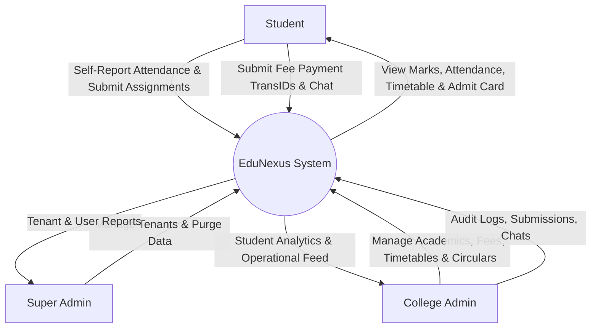

<div align="center">

</div>

# EduNexus - Multi-Tenant College Student Management System

EduNexus is a modern, enterprise-grade Multi-Tenant Student Management System (SMS) built on the **MERN** stack (MongoDB, Express.js, React, Node.js) with **Vite** and **TypeScript**. 

It is designed to cater to multiple educational institutions (tenants) simultaneously. Each college operates within its own custom institutional node, complete with unique sub-routing, customized visual themes, independent database indexing, and role-based permissions.

---

## 🚀 Key Features by User Persona

### 1. Super Administrator (System Owner)
*   **Institutional Provisioning**: Dynamically spawn new College Nodes (Tenants) by creating unique sub-slugs and assigning administrative domains.
*   **Tenant Control Panel**: Active status management (activate or suspend institutional domains).
*   **Visual Customization**: Configure institutional color palettes (primary/accent colors), logos, and basic metadata.
*   **Operational Purging**: Clear student and transaction records while keeping the admin node active, or purge the entire tenant from the system.

### 2. College Administrator (Institution Manager)
*   **Academics & Curriculum**: Define and update institutional departments and curriculum subjects.
*   **Student Registry**: Access real-time directories, edit profiles, and regulate account states.
*   **Self-Report Attendance Approval**: Monitor self-reported student attendance and approve or reject entries.
*   **Academic Grading**: Add/edit course marks or upload student grades in bulk using CSV file parsing mapped by Roll Number.
*   **Financial & Fee Invoicing**: Generate individual or bulk fee structures (tuition, hostels, exams) and track real-time collection logs.
*   **Weekly Timetables**: Configure and publish department-specific schedules.
*   **Admit Card Dispatcher**: Generate exam schedules and publish print-ready Admit Cards for student portals.
*   **Assignments Desk**: Create homework, projects, and lab assignments; review student solutions and grade submissions with constructive feedback.
*   **Circular Broadcasts**: Dispatch announcements to the entire institution or filter by department/semester.
*   **Direct Chat**: Real-time direct messaging interface with students.
*   **Audit Trails**: Inspect read-only logs recording administrative activity (marks upload, billing edits, attendance changes, and IP addresses) for audit compliance.

### 3. Student Portal
*   **Dashboard Widgets**: Real-time widgets displaying attendance rates, recent exam marks, due assignments, outstanding fees, and recent circulars.
*   **Attendance Reporting**: Self-report daily attendance with subject, date, and remark details.
*   **Grade Center**: Access report cards showing exam type marks, semesters, grades, and overall academic status.
*   **Exam Admit Cards**: View generated schedules and print or save official college Admit Cards as PDFs.
*   **Assignments Panel**: Submit textual answers and upload supporting file attachments (documents/images encoded to Base64) before deadlines.
*   **Fee Ledger**: View outstanding invoices, submit payment transaction details, and input transaction IDs for admin review.
*   **Advising Chat**: Communicate directly with college administrators regarding academic queries.

---

## 📊 Data Flow Diagrams (DFD)

### Level 0: Context Diagram
The Context Diagram represents the high-level boundary of the EduNexus system, showing how the three core user personas interact with the central application.



### Level 1: Process Flow Diagram
The Level 1 Diagram decomposes the system into core sub-processes, displaying the data exchange between external entities, processing modules, and backend MongoDB collections (Data Stores).

```mermaid
graph TD
    %% Entities
    ST[Student]
    AD[College Admin]
    SA[Super Admin]

    %% Processes
    P1(("P1: Auth & Session"))
    P2(("P2: Tenant Provisioning"))
    P3(("P3: Academic Registry"))
    P4(("P4: Student Academics"))
    P5(("P5: Assignments Portal"))
    P6(("P6: Fee & Billing"))
    P7(("P7: Chat & Broadcast"))
    P8(("P8: System Auditing"))

    %% Data Stores
    DS1[(DS1: Tenants)]
    DS2[(DS2: Users)]
    DS3[(DS3: Academics & Timetables)]
    DS4[(DS4: Assignments & Submissions)]
    DS5[(DS5: Fees)]
    DS6[(DS6: Messages & Alerts)]
    DS7[(DS7: Audit Logs)]

    %% Connections - Auth & Provisioning
    SA -->|1. Register/Purge Tenants| P2
    P2 -->|Create/Delete| DS1
    P2 -->|Register Admin| DS2
    
    ST & AD & SA -->|2. Login/Register| P1
    P1 <-->|Verify Credentials| DS2
    
    %% Connections - Academic Registry
    AD -->|3. Set Depts, Subjects, Timetable| P3
    P3 -->|Write Registry| DS3
    P3 -->|Verify College Node| DS1
    
    %% Connections - Student Academics (Marks, Attendance, Admit Cards)
    AD -->|4a. Grade Upload / Approve Attendance| P4
    ST -->|4b. Self-Report Attendance / Print Admit Card| P4
    P4 <-->|Read/Write Records| DS3
    
    %% Connections - Assignments
    AD -->|5a. Publish Assignments / Grade Submissions| P5
    ST -->|5b. Submit Solutions & Files| P5
    P5 <-->|Read/Write Submissions| DS4
    
    %% Connections - Fees
    AD -->|6a. Issue Fees / Invoice Students| P6
    ST -->|6b. Submit Payment TransID| P6
    P6 <-->|Read/Write Financials| DS5

    %% Connections - Communication
    ST & AD -->|7a. Send Chat Messages| P7
    AD -->|7b. Broadcast Circulars| P7
    P7 <-->|Store Message/Alert| DS6

    %% Connections - Auditing
    AD -->|8a. Trigger Action| P8
    P8 -->|Write Audit Entry| DS7
    AD -->|8b. View Log Feed| P8
    DS7 -->|Retrieve Trails| P8
```



---

## 🔄 Project Workflow & Operations Lifecycle

The operational lifecycle of the EduNexus platform follows these steps:

1.  **System Seeding**:
    *   Initialize the database to seed the default Super Admin credential (`admin@edunexus.global`).
2.  **Institutional Creation**:
    *   The Super Admin logs in, creates a College Node (e.g., *Stanford University* with slug `stanford`), configures allowed domain settings, and creates a designated College Administrator account.
3.  **Academic Setup**:
    *   The College Admin logs in and registers academic departments (e.g., Computer Science, Electrical Engineering) and teaching subjects.
4.  **Student Onboarding**:
    *   Students register on the portal by entering their details, roll number, department, semester, and matching their college's registration slug.
5.  **Academics & Grading**:
    *   College Admins post class timetables and set exam schedules.
    *   Admins publish assignments. Students submit solutions (with base64 file attachments), which are graded by admins.
    *   Admins manage attendance records and upload student marks (manually or via bulk CSV import).
6.  **Billing & Communications**:
    *   Admins dispatch college-wide notices and issue student fees.
    *   Students report payments by providing transaction IDs. Admins verify and mark payments as paid.
    *   Students and admins communicate via direct messages.
7.  **Audit Logs**:
    *   System records administrative actions (IP addresses, action types, targets, and dates) in the audit logs for accountability.

---

## 🗄️ Database Schema Design

EduNexus uses MongoDB with mongoose schemas. Essential models include:

*   **Tenant Schema**: Stores details for each college (e.g. name, slug, theme configs, department list, curriculum subjects).
*   **User Schema**: Holds accounts for students, admins, and superadmins, including profile info, academic credentials, and session tracking.
*   **Attendance Schema**: Records student attendance logs and approval states.
*   **Mark Schema**: Stores grades categorized by subject, exam type, and semester.
*   **Fee Schema**: Manages student invoices, due dates, statuses, and transaction details.
*   **Timetable Schema**: Maps department class schedules to days, times, rooms, and teachers.
*   **Assignment & AssignmentSubmission Schemas**: Tracks homework requirements and student file uploads (encoded to Base64).
*   **AdmitCard Schema**: Stores exam timetables and generation states for printing.
*   **Message & Notification Schemas**: Powers internal chat logs and system broadcast alerts.
*   **AuditLog Schema**: Chronologically records admin changes with IPs for compliance.

---

## ⚙️ Local Installation & Setup

### Prerequisites
*   [Node.js](https://nodejs.org/) (v18 or higher recommended)
*   [MongoDB](https://www.mongodb.com/) (Local Community Server or MongoDB Atlas account)

### Step 1: Clone and Install Dependencies
Navigate to your project folder and run:
```bash
npm install
```

### Step 2: Configure Environment Variables
Create a `.env` file in the root directory and add:
```env
MONGODB_URI="mongodb://127.0.0.1:27017/edunexus" # Or your MongoDB Atlas connection string
JWT_SECRET="your_jwt_secret_key_change_in_production"
PORT=3000
NODE_ENV=development
```

### Step 3: Initialize System Database
Seed the Super Admin account into your database:
```bash
npm run init-db
```
*   **Default Super Admin Email**: `admin@edunexus.global`
*   **Default Super Admin Password**: `SecurePassword123!`

### Step 4: Run the Application
Start both the Express backend and the Vite development server:
```bash
npm run dev
```
Open your browser and navigate to `http://localhost:3000`.

---

## 🛠️ Utility Scripts
*   `npm run dev`: Starts the TypeScript Vite/Express development environment.
*   `npm run build`: Compiles the React client code to the production static `dist` bundle.
*   `npm run start`: Starts the Express production server.
*   `npm run init-db`: Runs `init-system.ts` to set up the default Super Admin user.
*   `npx tsx reset_admin.ts`: Resets a user's password using the configuration inside the script.
*   `npx tsx find_admins.ts`: Queries and lists all administrative emails registered in the database.

---

## 🔌 Core API Endpoints

| Method | Endpoint | Access Level | Description |
| :--- | :--- | :--- | :--- |
| **POST** | `/api/system/init-superadmin` | Public | Installs default system-wide Super Admin. |
| **POST** | `/api/auth/register` | Public | Registers a new student under a specific college slug. |
| **POST** | `/api/auth/login` | Public | Validates user credentials and issues a JWT session token. |
| **GET** | `/api/auth/me` | Logged In | Retrieves authenticated user profile info. |
| **PUT** | `/api/auth/profile` | Logged In | Updates profile details (photo, phone, bio, name). |
| **GET** | `/api/admin/dashboard` | Admin / Super Admin | Retrieves administrative analytics, student directories, and logs. |
| **PUT** | `/api/admin/attendance/:id` | Admin / Super Admin | Approves or rejects self-reported student attendance logs. |
| **POST** | `/api/admin/marks` | Admin / Super Admin | Creates or updates an individual student subject score. |
| **POST** | `/api/admin/marks/csv` | Admin / Super Admin | Parses a CSV file to import student marks in bulk by Roll Number. |
| **POST** | `/api/admin/fees/bulk` | Admin / Super Admin | Issues fee structures to all students of the tenant in bulk. |
| **POST** | `/api/student/fee/pay` | Student | Submits transaction detail IDs for payment approval. |
| **GET** | `/api/superadmin/tenants` | Super Admin | Lists all institutional college tenants in the database. |
| **DELETE** | `/api/superadmin/tenants/:id` | Super Admin | Permanently deletes a tenant and purges all student records. |

---

## 🎨 Technology Stack
*   **Frontend**: React 19, React Router DOM v7, Tailwind CSS v4, Lucide React Icons, Motion (Framer Motion)
*   **Backend**: Node.js, Express.js (REST API, Helmet security, rate-limiting, cookie-parser)
*   **Database**: MongoDB, Mongoose (indexing, referential schemas)
*   **Runtime Utilities**: TSX (TypeScript Execute), JWT (JSON Web Token authentication), Bcryptjs (password hashing)
